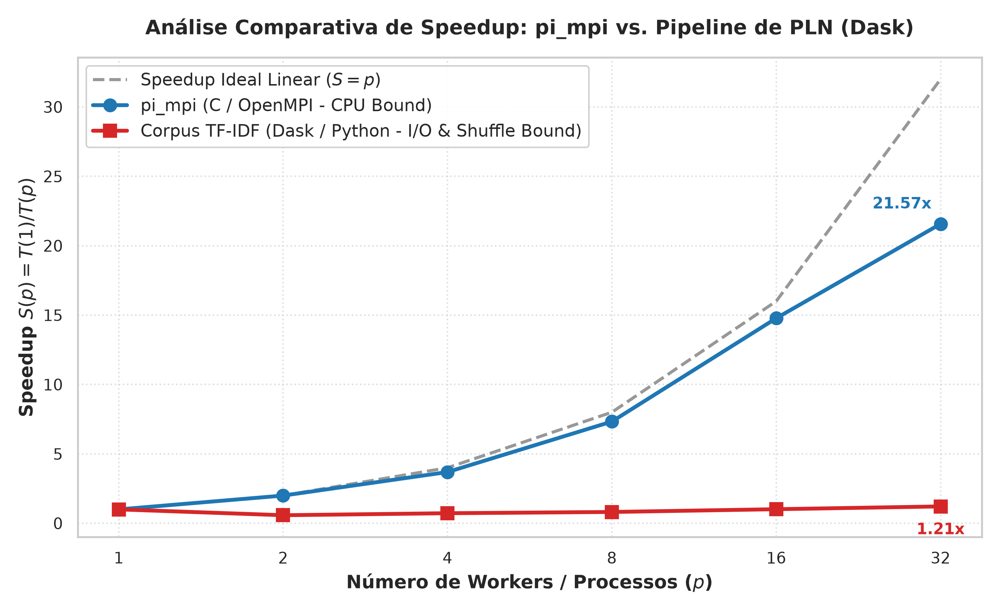

# Análise Individual de Desempenho HPC: Pipeline de PLN em Dask vs. Baseline MPI

**Autor:** Igor Oliveira  
**Curso / Módulo:** High Performance Computing (HPC), Inteli 2026.2  
**Professor:** João Luisi  
**Infraestrutura:** Cluster Bare-Metal OpenHPC (1 Nó Master + 4 Nós de Processamento `c1`–`c4`), SLURM 25.11.4, NFS Compartilhado, Rede Gigabit Ethernet (1 Gbps).  
**Processadores:** Intel Core i3-13100T (4 núcleos físicos × 2 threads SMT = 8 CPUs lógicas por nó; 16 cores físicos e 32 CPUs lógicas no cluster).

---

## 1. Código Python e Gráfico Comparativo de Speedup

Para avaliar a escalabilidade da infraestrutura distribuída, desenvolvi o script em Python abaixo. O código lê os tempos medidos para a aplicação CPU-bound em C com MPI (`pi_mpi`, Parte 1) em `resultados/speedup.csv` e para o pipeline de PLN em Dask sobre o corpus Amazon Polarity (Parte 2) em `resultados/speedup_corpus.csv`.

No script, calculo o *speedup* $S(p) = \frac{T(1)}{T(p)}$ e gero um gráfico comparativo em escala logarítmica ($\log_2$) com a curva ideal linear, a curva do `pi_mpi` e a curva do pipeline do corpus.

### 1.1 Código do Script Python (`pipeline/plota_curvas_igor.py`)

```python
#!/usr/bin/env python3
"""
plota_curvas_igor.py
Script para leitura dos resultados de speedup e geração do gráfico comparativo
entre Speedup Ideal Linear, pi_mpi e Pipeline de PLN em Dask.
Desenvolvido por Igor Oliveira.
"""

import pandas as pd
import matplotlib.pyplot as plt
import seaborn as sns

def gerar_grafico(speedup_pi_csv, speedup_corpus_csv, output_png):
    # Configuração do estilo gráfico (Seaborn / Matplotlib)
    sns.set_theme(style="whitegrid", palette="muted")
    plt.rcParams.update({
        'font.size': 11,
        'axes.labelsize': 12,
        'axes.titlesize': 13,
        'xtick.labelsize': 10,
        'ytick.labelsize': 10,
        'legend.fontsize': 11,
        'figure.titlesize': 14
    })

    # Carregamento dos dados dos CSVs
    df_pi = pd.read_csv(speedup_pi_csv)
    df_corpus = pd.read_csv(speedup_corpus_csv)

    # Tratamento pi_mpi: menor tempo t_total por número de processos (Aula 3)
    pi_summary = df_pi.groupby('nprocs')['t_total'].min().reset_index()
    t1_pi = pi_summary.loc[pi_summary['nprocs'] == 1, 't_total'].values[0]
    pi_summary['speedup'] = t1_pi / pi_summary['t_total']

    # Tratamento Corpus PLN: mediana do tempo t_total por número de workers (Aula 5)
    corpus_summary = df_corpus.groupby('nprocs')['t_total'].median().reset_index()
    t1_corpus = corpus_summary.loc[corpus_summary['nprocs'] == 1, 't_total'].values[0]
    corpus_summary['speedup'] = t1_corpus / corpus_summary['t_total']

    workers = sorted(pi_summary['nprocs'].unique())

    # Criação da figura
    fig, ax = plt.subplots(figsize=(9, 5.5), dpi=300)

    # Curva 1: Speedup Ideal Linear (S = p)
    ax.plot(workers, workers, '--', color='#7f7f7f', label='Speedup Ideal Linear ($S = p$)', linewidth=2, alpha=0.8)

    # Curva 2: pi_mpi (CPU-Bound, C / OpenMPI)
    ax.plot(pi_summary['nprocs'], pi_summary['speedup'], 'o-', color='#1f77b4', 
            label='pi_mpi (C / OpenMPI - CPU Bound)', linewidth=2.5, markersize=8)

    # Curva 3: Pipeline Corpus PLN (I/O & Network-Bound, Dask / Python)
    ax.plot(corpus_summary['nprocs'], corpus_summary['speedup'], 's-', color='#d62728', 
            label='Corpus TF-IDF (Dask / Python - I/O & Shuffle Bound)', linewidth=2.5, markersize=8)

    # Configuração do eixo X em log base 2
    ax.set_xscale('log', base=2)
    ax.set_xticks(workers)
    ax.get_xaxis().set_major_formatter(plt.ScalarFormatter())

    # Anotações dos pontos em 32 workers
    s_pi_max = pi_summary.loc[pi_summary['nprocs'] == 32, 'speedup'].values[0]
    s_corp_max = corpus_summary.loc[corpus_summary['nprocs'] == 32, 'speedup'].values[0]
    
    ax.annotate(f'{s_pi_max:.2f}x', (32, s_pi_max), textcoords="offset points", xytext=(-25, 10), ha='center',
                fontweight='bold', color='#1f77b4', fontsize=10)
    ax.annotate(f'{s_corp_max:.2f}x', (32, s_corp_max), textcoords="offset points", xytext=(0, -18), ha='center',
                fontweight='bold', color='#d62728', fontsize=10)

    # Rótulos e Título
    ax.set_xlabel('Número de Workers / Processos ($p$)', fontweight='bold')
    ax.set_ylabel('Speedup $S(p) = T(1) / T(p)$', fontweight='bold')
    ax.set_title('Análise Comparativa de Speedup: pi_mpi vs. Pipeline de PLN (Dask)', fontweight='bold', pad=15)

    ax.grid(True, which="both", linestyle=":", alpha=0.6)
    ax.legend(loc='upper left', frameon=True, facecolor='white', framealpha=0.9)

    plt.tight_layout()
    plt.savefig(output_png)
    print(f"Gráfico salvo em: {output_png}")

if __name__ == '__main__':
    gerar_grafico('resultados/speedup.csv', 'resultados/speedup_corpus.csv', 'resultados/curvas_comparativas_igor.png')
```

### 1.2 Gráfico Gerado


*Figura 1: Curvas de speedup medidos para a aplicação `pi_mpi` e para o pipeline de PLN em Dask em relação ao speedup linear ideal.*

### 1.3 Tabela Consolidada de Resultados

| Workers ($p$) | Nós Físicos | `pi_mpi` $T_{total}$ (s) | Speedup `pi_mpi` | Eficiência `pi_mpi` | Corpus PLN $T_{total}$ (s) | Speedup Corpus | Eficiência Corpus | $T_{serial}$ Corpus (s) | $T_{calc}$ Corpus (s) |
|:---:|:---:|:---:|:---:|:---:|:---:|:---:|:---:|:---:|:---:|
| **1** | 1 | 34,87 | 1,00× | 100% | 27,34 | 1,00× | 100% | 16,97 | 10,21 |
| **2** | 1 | 17,48 | 1,99× | 100% | 47,16 | 0,58× | 29% | 41,10 | 5,93 |
| **4** | 1 | 9,45 | 3,69× | 92% | 37,75 | 0,72× | 18% | 33,72 | 4,04 |
| **8** | 2 | 4,76 | 7,33× | 92% | 33,58 | 0,81× | 10% | 30,23 | 3,35 |
| **16** | 4 | 2,36 | 14,78× | 92% | 26,98 | 1,01× | 6% | 24,93 | 1,65 |
| **32** | 4 | 1,62 | 21,57× | 67% | 22,51 | 1,21× | 4% | 20,49 | 2,01 |

---

## 2. Discussão dos Gargalos de Desempenho

Na Figura 1, observo a diferença de comportamento entre o programa C/MPI (`pi_mpi`) e o pipeline de PLN em Dask. Enquanto o `pi_mpi` escala até 16 workers (speedup de $14,78\times$ e eficiência de 92%), o pipeline de PLN sofre redução de desempenho ao passar de 1 para 2 workers ($S = 0,58\times$) e atinge $1,21\times$ com 32 workers.

Discuto a seguir os três gargalos que explicam esses resultados.

---

### 2.1 I/O e Rede no NFS (Network File System)

O pipeline de PLN processa 300.000 resenhas de texto (32 arquivos Parquet, 83 MB compactados) armazenados no NFS em `/opt/ohpc/pub`, servido pelo nó master.

1. **Leitura Concorrente:**  
   Com $p=1$, o worker lê os arquivos via NFS sem concorrência. Ao expandir para 8, 16 ou 32 workers nos 4 nós (`c1`–`c4`), múltiplos processos requisitam dados simultaneamente ao daemon `nfsd` do master. Como a rede é Gigabit Ethernet (1 Gbps, ~107 MB/s medidos), o link do master torna-se um ponto de contenção.
   
2. **Tempo de Subida e Carga de Dependências (`t_sobe`):**  
   O NFS também afeta a inicialização dos workers. O tempo de subida do cluster (`t_sobe`) passa de **2,93 s** em 1 nó para **36,94 s** em 4 nós, pois cada processo carrega o interpretador Python 3.11 e as bibliotecas (`pandas`, `pyarrow`, `scikit-learn`, `dask`) via rede.

3. **Comparação com o `pi_mpi`:**  
   O `pi_mpi` é um programa CPU-bound. Cada processo MPI recebe apenas parâmetros iniciais reduzidos e não realiza leitura de disco nem de rede durante o cálculo. Portanto, o tempo de E/S é nulo.

---

### 2.2 Shuffle, Serialização Interprocessos e Rede Gigabit

O fator principal para a queda de speedup no Dask ao passar de 1 para 2 workers é o custo das **operações de agregação larga (*wide operations*)** na vetorização TF-IDF.

1. **Transformações Estreitas (*Narrow*) vs. Largas (*Wide*):**  
   * **Etapas Estreitas (Tokenização, Stopwords, Term Frequency - `t_calc`):** São paralelizáveis e não exigem troca de dados entre workers. A tokenização cai de **4,72 s** (1 worker) para **0,37 s** (16 workers), e a remoção de stopwords cai de **2,31 s** para **0,22 s**.
   * **Etapas Largas (Frequência de Documentos `df` e Estatísticas `stats`):** Para calcular a frequência de ~196.000 termos no corpus, o Dask realiza uma operação de **Shuffle / All-to-All Reduction**, exigindo sincronização global.

2. **Custo de Serialização em Python (`pickle` / IPC):**  
   * Com **1 worker**, as tabelas de frequência permanecem na memória RAM local. Sem serialização, a agregação `df` leva **7,31 s** e `stats` leva **7,35 s**.
   * Com **2 ou mais workers**, o Dask converte os dicionários Python em bytes (`cloudpickle`/`msgpack`), transmitindo-os via IPC/sockets para mesclagem. O tempo de `df` sobe para **16,33 s** e o de `stats` para **23,01 s**, mesmo no mesmo nó físico. Na rede Gigabit, essa transferência de objetos serializados satura o barramento e a CPU.

3. **Comparação com o `pi_mpi`:**  
   No `pi_mpi`, a comunicação ocorre ao final via `MPI_Reduce`, onde cada worker transmite **um número de ponto flutuante (8 bytes)**. O custo de serialização e comunicação é mínimo.

---

### 2.3 Hyperthreading (SMT) a partir de 16 Workers

O cluster possui 4 nós, cada um com um processador Intel Core i3-13100T (4 núcleos físicos e 8 threads lógicas via SMT), somando **16 cores físicos** e **32 threads lógicas**.

1. **Comportamento até 16 Workers:**  
   Até 16 workers, cada processo ocupa um núcleo físico exclusivo. Nesse ponto, o pipeline Dask atinge speedup de $1,01\times$ e o `pi_mpi` atinge $14,78\times$ (92% de eficiência).

2. **Comportamento em 32 Workers (SMT):**  
   * **`pi_mpi`:** O speedup sobe de $14,78\times$ para $21,57\times$, mas a eficiência cai de 92% para 67%. Duas threads no mesmo núcleo compartilham as unidades lógicas e aritméticas (ALU/FPU), gerando ganho de ~45% sem duplicar o desempenho.
   * **Pipeline Dask PLN:** O tempo de cálculo (`t_calc`) piora de **1,65 s** (16 workers) para **2,01 s** (32 workers). A alocação de 8 processos por nó gera disputa por cache L3 e memória RAM, reduzindo a eficiência para 4%.

---

## 3. Estimativa da Fração Serial pela Lei de Amdahl

Utilizo a Lei de Amdahl para estimar o limite teórico de speedup $S(p)$ em função da Fração Serial ($f$):

$$S(p) = \frac{1}{f + \frac{1 - f}{p}}$$

Isolando $f$ com base nos valores medidos de $S(p)$:

$$f = \frac{\frac{1}{S(p)} - \frac{1}{p}}{1 - \frac{1}{p}}$$

---

### 3.1 Fração Serial no `pi_mpi`

No `pi_mpi`, a fração serial inclui apenas a inicialização (`MPI_Init`), leitura de argumentos e redução final (`MPI_Reduce`).

Para $p=16$ ($S(16) = 14,78$):

$$f_{pi} = \frac{\frac{1}{14,78} - \frac{1}{16}}{1 - \frac{1}{16}} \approx 0,0055 \ (0,55\%)$$

Com $f \approx 0,55\%$, o teto teórico de speedup do `pi_mpi` é:

$$S_{\infty} = \frac{1}{f} \approx 181,8\times$$

---

### 3.2 Fração Serial no Pipeline Dask (PLN)

Ao aplicar a Lei de Amdahl ao pipeline em Dask:

1. **Limitação da Fórmula Clássica:**  
   Como $S(p) < 1,00$ para $p=2, 4, 8$ ($S(2) = 0,58$), a fórmula resulta em $f > 1$. Uma regressão linear limita o valor em $f = 1,00$.

2. **Estimativa por Decomposição Interna ($p=1$):**  
   Divido o tempo das etapas seriais/largas ($T_{serial} = 16,97\text{ s}$) pelo tempo total ($T_{total} = 27,34\text{ s}$) com 1 worker:

   $$f_{est} = \frac{T_{serial}}{T_{total}} = \frac{16,97}{27,34} \approx 0,6207 \ (62\%)$$

   Com $f = 62\%$, o teto máximo de speedup é:

   $$S_{\infty} = \frac{1}{0,6207} \approx 1,61\times$$

   Esse limite ($1,61\times$) aproxima-se do valor máximo medido de **$1,21\times$ com 32 workers**.

---

### 3.3 Métrica de Karp-Flatt

Aplico a **Métrica de Karp-Flatt** $e(p)$ para avaliar a fração serial efetiva com overheads variáveis:

$$e(p) = \frac{\frac{1}{S(p)} - \frac{1}{p}}{1 - \frac{1}{p}}$$

Valores calculados de $e(p)$:

* $e(2) = 2,45$
* $e(4) = 1,51$
* $e(8) = 1,26$
* $e(16) = 0,99$
* $e(32) = 0,82$

#### Interpretação de $e(p)$:
Se a perda de desempenho fosse causada por uma fração serial constante, $e(p)$ permaneceria fixo. Como **$e(p)$ decresce continuamente** (de 2,45 para 0,82), concluo que o gargalo do Dask decorre de um **custo fixo de inicialização e serialização**, que é diluído à medida que o número de workers aumenta.

---

## 4. Conclusões e Recomendações

Sintetizo as observações da análise:

1. **Aplicações CPU-Bound vs. Data-Intensive:** Aplicações com cálculo puro e pouca comunicação (`pi_mpi`) apresentam escalabilidade quase linear em redes Gigabit, limitadas apenas pela concorrência SMT.
2. **Pipeline em Dask:** O pipeline de PLN é limitado pela **serialização nas operações de Shuffle All-to-All** (`df` e `stats`) e pela concorrência de E/S no NFS.

### Recomendações para a Versão 2 (v2):
* **Pré-combinação Local (*Tree Reduction*):** Realizar agregações parciais na memória local dos workers antes do envio via rede.
* **Vetorização Binária:** Substituir dicionários Python por estruturas binárias (NumPy / Apache Arrow), eliminando o overhead de `pickle`.
* **Disco Local (Scratch SSD):** Copiar as partições do dataset para discos SSD locais de cada nó no início da execução, reduzindo a concorrência no NFS.
